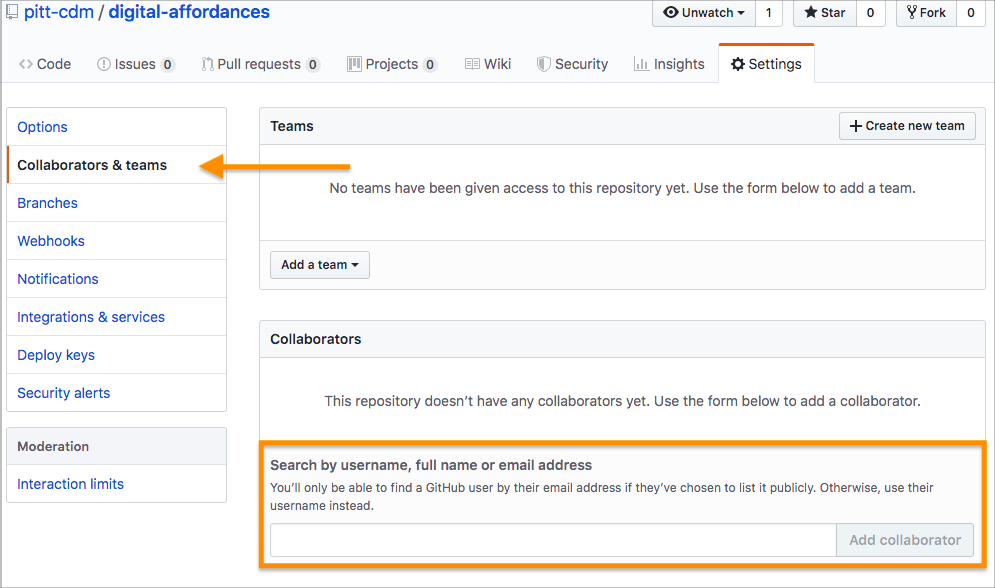

# Practice forking an assignment repository and editing its files

## A few terms of art
A **repository**, often abbreviated to **repo**, is just a fancy way of saying _folder_. It's a bunch of files. It can have subfolders inside it. You're looking at a repository right now! (See the files up above this text?)

This text is, itself, coming from a single file inside the repository, with the special name of **README.md**. Anything appearing in the README will show up here.

To **fork** a repo is to _make a copy_ of it: all the files, and – interestingly – the complete \*history\* of those files. This lets you safely play with and edit the files, without worrying that you'll overwrite someone else's work. For today, I've asked you to work in teams; for the major projects coming up, you'll each have an individual set of files.

## Your task: use the "five principles" as a lens
For this particular assignment, I'm asking you to work in groups to apply the ideas from [Sorapure's "Playing Lev Manovich"](http://kairos.technorhetoric.net/8.2/binder2.html?coverweb/sorapure/index.htm). What do the "five principles of new media" help you see?

### I. Make a copy you can edit
1. To start, the team anchor should **Fork this repository,** using the button at the top right. 
2. Once you have your own copy, go into your Settings...  
3. ... and **add your groupmates as collaborators**. (You'll need to ask for their usernames or email addresses.)

### II. Do the work
1. **Create a new file**, named for one of the five principles in Sorapure: numerical-representation.md, modularity.md, automation.md, variability.md, or transcoding.md
   - Five groups, so each group will start with a different file.
   - Note that filenaming convention: all lowercase, no spaces.
   - The .md file extension lets you use ["markdown" syntax](https://guides.github.com/features/mastering-markdown/), but you can ignore this for now if you want.
2. In that file, you're going to **make a list** of examples of where you've seen that principle in action.
   - What does this principle help you notice in conjunction with [Wesch's "Information R/evolution"](http://www.youtube.com/watch?v=-4CV05HyAbM) video, for example?
   - What other examples from your digital day-to-day come to mind as you think about this principle?
3. **Take turns** adding to the file, saving as you go, so that **everyone in the group gets to make at least one commit.**
   - Use meaningful commit messages.
   - Think of the main commit message as the subject line of an email, and the optional extension as the email body.
4. Consider: Manovich was talking about "new media," not "digital media." Is there a difference? If time allows, **make some notes.**

EXT: If you finish working on one file and are waiting for other groups, go back to step one and move on to the next "principle."
